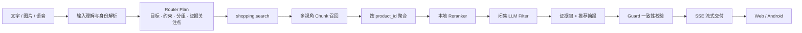
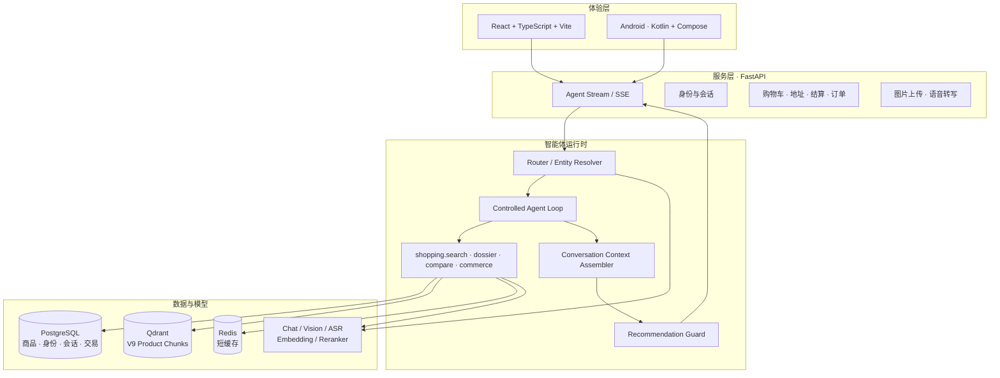

<p align="center">
  
</p>

<h1 align="center">欧米 · OmniCart Agent</h1>

<p align="center">
  <strong>一个把“我想买什么”变成可信选择与可执行交易的多模态购物智能体。</strong>
</p>

<p align="center">
  
  
  
  
</p>

> 购物推荐不应只是“搜到一堆商品”。欧米以用户需求为起点，受控地完成理解、召回、筛选、核对、解释与交易动作，让推荐结果既有用，也有边界。

---

## 项目愿景

欧米是面向真实购物场景构建的 Agentic Commerce 系统。它能理解自然语言、图片与语音输入：

- 想买什么：把模糊偏好、预算、场景、避雷项拆成可执行的购物计划；
- 哪些值得看：基于商品身份、规格、说明、FAQ 与评价进行商品级聚合，而不是只返回命中文本块；
- 为什么推荐：给出适合原因、购买前注意点、资料状态与统一的适配指数；
- 怎么继续：支持单品“问欧米”、同类横向对比、加购、结算、地址与订单闭环；
- 能否持续理解：登录用户拥有受控会话上下文与偏好记忆，游客仍可匿名完成一次性推荐。

这不是一个把模型直接接到商品库上的聊天框，而是一条面向交付质量设计的购物决策链路。

## 核心能力

| 能力 | 用户看到的体验 | 系统如何保证可靠 |
| --- | --- | --- |
| 常规推荐 | 快速给出首选、备选与简洁购买建议 | 一次受控 `shopping.search`，内部完成计划、召回、重排、闭集筛选与证据整理 |
| 深度思考 | 复杂问题会逐步显示“正在理解 / 比对 / 核对 / 整理” | 有预算的 Agent Loop 按需调用工具，拦截重复与越权调用，收敛后统一交付 |
| 精准商品识别 | “iPhone 15”“苹果 15”等表达不会被泛品类淹没 | 品牌、产品线、型号、规格与别名构成商品身份层，先锁定可信范围 |
| 问欧米 | 聚焦一件商品，获得规格、口碑、风险与适用建议 | `shopping.product_dossier` 只接收已验证商品 ID，生成可追溯的单品档案 |
| 同类横向对比 | 一键看懂同类商品差异与取舍 | 专用同类对比链路在相同细分类内做去重、价格带与特征对齐 |
| 拍照识图 | 先说明图中识别到什么，再决定分析或推荐 | 视觉模型只提取身份线索；目录解析器在商品库中闭集匹配，不使用图片向量“猜商品” |
| 语音购物 | 说出需求后进入与文字相同的推荐流程 | 专用 ASR 转写、音频格式校验与转写质量门控，随后复用同一 SSE 工作流 |
| 交易闭环 | 加入购物车、下单、地址与订单管理 | 交易类工具与身份解析由服务端约束；游客可推荐，交易操作需要登录 |

## 从一句话到一份购物建议



### 1. 先理解任务，而不是急着搜

`Router Plan` 将一次输入变成结构化购物任务：意图、检索分组、每组检索词、实体词、必须满足的条件、偏好、避雷项、证据关注点、回答目标与歧义状态。

多目标请求不会被压成一个模糊 Query。例如“想买好吃的好喝的，但不想太有负担”可以被表达为相互独立的零食与饮品分组；任一分组缺失时，系统会如实说明，而不是悄悄漏掉半个需求。

### 2. 用商品级检索替代“命中一段文本就推荐”

当前主检索使用 **V9 多视角商品 Chunk 索引**。每个 Chunk 都携带商品身份锚点、类目、价格与来源定位，并最终按 `product_id` 聚合：

| Chunk 类型 | 内容 | 在决策中的角色 |
| --- | --- | --- |
| `identity` | 标题、品牌、类目、价格、SKU 规格 | 锁定商品身份与硬信息 |
| `facts` | 可回溯的结构化属性 | 支持规格与约束判断 |
| `marketing` | 按语义边界切分的商品说明 | 解释核心卖点与使用场景 |
| `faq` | 官方问答单元 | 回答使用、规格与兼容性问题 |
| `review` | 原始用户评价片段 | 提供真实体验信号 |
| `review_aspect` | 可回溯的好评体验 / 使用注意聚合 | 在不淹没上下文的前提下呈现口碑与风险 |

一次 `shopping.search` 的执行边界清晰：

```text
该次工具 Query + Router 子目标
  → 一次 Query Embedding
  → Dense / 必要时 Dense + Sparse Chunk 召回
  → Top 100 Chunk 按商品聚合为 Top 24
  → 本地 BGE Reranker 压缩至 Top 12
  → 闭集 LLM Filter
  → 并行整理证据与评分
  → 返回受控商品结果
```

评论、FAQ 与说明都会参与检索，但不会让一条孤立评论决定商品排序；商品身份、规格和跨来源支持会共同参与聚合。

### 3. 让 LLM 做擅长的判断，并限制它不该做的事

LLM 在欧米中不是不受限制的“裁判”。它只在候选已经缩小后进行闭集决策：

- 只能从本次 Top 12 候选中返回商品 ID；
- 明确区分首选、备选、有条件匹配与排除；
- 必须考虑预算、硬约束、避雷项和资料缺口；
- 不得臆造库外商品、型号、价格或健康功效；
- 非法 JSON、超时或越权 ID 会被服务端校验拦截，并稳定降级到已重排候选。

最终结果会进一步收敛为“推荐简报”。正文、主推卡、备选卡、单品分析与证据范围都从同一份简报出发，再经 Guard 校验，避免“说的是 A，卡片却是 B”。

## 两种工作模式，同一份交付标准

| | 常规推荐 | 深度思考 |
| --- | --- | --- |
| 适用场景 | 日常选购、明确需求、快速决策 | 多目标、需要反复核对、对比或复杂追问 |
| 编排方式 | Router 后执行一次受控搜索批次 | Router 与可信范围初始化后进入有限 Agent Loop |
| 工具调用 | 固定、少而稳 | 按需调用，但受轮次、工具预算与重复签名限制 |
| 可见过程 | 单个动态进度状态 | 同样只展示用户友好的阶段，不展示思维链、工具参数或 scratchpad |
| 最终交付 | 首选 / 备选、证据状态、流式自然语言 | 与常规模式相同的推荐简报、卡片协议与 Guard |

深度模式的运行时借鉴了现代 Agent harness 的分层思想，将能力拆为：

```text
ToolPolicy → ToolExecutor → ToolResult Reducer → StopPolicy
```

`ToolPolicy` 在调用前校验 schema、权限、锁定商品范围、预算与语义重复；调用后由 Reducer 有序合并候选组、证据和状态补丁。失败只记录为可理解的原因，不会覆盖已经成功的结果。`StopPolicy` 在需求已覆盖、信息不再增益或预算耗尽时强制收敛到回答。

## 多模态不是“多一个上传按钮”

### 图片：实体锁定优先

视觉链路不使用图像 Embedding 去相似搜索商品图。商品图、海报与拍摄环境往往不稳定，图片相似不等于商品身份相同。欧米采用：

```text
图片预处理 → 视觉实体提取 → VisualCatalogResolver 目录匹配
  ├─ exact_product：锁定商品，进入单品档案
  ├─ product_family：展示同系列版本，请用户确认
  └─ ambiguous / no_match：先说明已识别线索，再进入受约束的同类推荐
```

目录匹配只使用品牌、商品名、产品线、型号、规格、SKU、类目与别名，排序优先级为“型号精确 > 品牌一致 > 名称/别名相似 > 规格一致 > 类目一致”。因此系统会诚实地区分“已锁定商品”与“未确认具体型号”。

### 语音：转写后走同一条购物链路

语音输入由 `qwen3-asr-flash` 转写，服务端校验真实音频容器、大小与时长，并对不含有效购物语义或带有服务提示污染的结果进行门控。转写成功后，文本会进入和键盘输入完全一致的 SSE 推荐工作流；不会额外分叉一套“语音推荐逻辑”。

## 一份干净、连续、可审计的回答上下文

最终回答模型只从 `ConversationContextAssembler` 获得单一 `AnswerContext`。其优先级如下：

1. 当前用户问题、Router Plan、硬约束与本轮交付目标；
2. 当前会话检查点：已确认需求、预算/避雷、锁定商品、已做决定与待确认事项；
3. 最近两个完整的用户—助手回合；
4. 本轮已校验的推荐简报、证据包与受控卡片范围；
5. 与本轮相关且未过期的登录用户偏好；
6. 必要的视觉识别结论等外部事实。

原始工具参数、工具全文、过期候选、ReAct 草稿和 scratchpad 不会被注入最终回答。会话消息是事实源；检查点是可版本化、可重建的上下文投影。这样既能处理“第二款便宜一点”“换个颜色”等连续追问，也能在用户明确换品类时干净地结束旧约束。

## 评分：展示给用户的不是检索分

向量相似度、重排分和 LLM 过滤结论各有用途，但都不应直接冒充“商品质量分”。欧米将它们分离：

- `retrieval_rank`：只用于候选排序；
- `filter_verdict`：首选 / 备选 / 有条件匹配 / 排除的闭集购物判断；
- `evidence_status`：资料是否足以支撑当前判断；
- **欧米适配指数**：基于本次需求契合、预算适配与资料完整度的可复算评分，仅表示“这件商品对这次需求值不值得优先看”。

卡片和详情页同时展示适配指数、文字化匹配标签、证据状态、适合原因与注意点。超预算、硬条件未满足或明确避雷的商品不能被资料多、价格低等信号“冲成高分”。

## 流式交付协议

Web 与 Android 消费同一套公开 SSE 事件语义，后端协议标识为 `chat_event_v1`：

```text
stage → visual_result → recommendations → focus_analysis / comparison → token → result → done
```

- `stage`：只输出“正在理解需求 / 正在挑选商品 / 正在核对依据 / 正在整理建议”等可理解状态；
- `recommendations`：携带首选、备选、评分、证据与分组状态；
- `focus_analysis` / `comparison`：承载单品档案或同类横向对比；
- `token`：真实模型输出的增量文本；
- `result`：包含可持久化的完整受控结果；
- `done`：标记请求完成。

客户端布局可不同，但操作逻辑一致：图片、短标题、价格、匹配标签、证据状态、适合原因、注意点、问欧米、同类横向对比和购物动作使用同一份数据契约。

## 技术架构



| 层级 | 主要实现 |
| --- | --- |
| 后端 | Python 3.11+、FastAPI、Pydantic Settings、SQLAlchemy Async、Alembic、LangGraph |
| 检索 | Qwen Embedding、Qdrant、可选 Sparse / RRF、本地 BGE Reranker、商品级聚合与闭集 LLM Filter |
| 数据 | PostgreSQL、Redis、Qdrant；商品身份、别名、SKU、RAG 知识与会话检查点分层存储 |
| Web | React、TypeScript、Vite、Zustand、TanStack Query、Tailwind CSS |
| Android | Kotlin、Jetpack Compose、Material 3、Retrofit / OkHttp、Coil |
| 可观测性 | 请求追踪、工具账本、上下文 Manifest、候选范围、Filter、评分、Guard 与降级原因的受控记录 |

## 仓库结构

```text
OmniCart-Agent/
├── backend/
│   ├── app/
│   │   ├── agents/                 # Router、检索、决策、回答与视觉 Agent
│   │   ├── api/                    # SSE、商品、上传、语音、购物与账户 API
│   │   ├── context/                # 会话检查点与 AnswerContext 组装
│   │   ├── workflow/react/         # ToolPolicy、运行时、Reducer 与停止策略
│   │   ├── retrieval/              # V9 Chunk 检索、聚合、重排
│   │   ├── services/               # Filter、评分、对比、视觉目录解析等
│   │   └── models/                 # 商品、身份、会话、偏好、交易模型
│   └── tests/
├── web-client/                     # React Web 客户端
├── android-client/                 # Jetpack Compose Android 客户端
├── ecommerce_agent_dataset/        # 原始电商商品数据集
├── scripts/                        # 建库、索引、评测与运维脚本
├── alembic/                        # 数据库迁移
├── docs/                           # 设计、提交与工程文档
├── docker-compose.yml              # PostgreSQL / Qdrant / Redis / 后端
└── run.py                          # 本地一键启动器
```

## 快速开始

### 前置条件

- Python 3.11+
- Node.js 20+
- Docker Desktop（推荐，用于 PostgreSQL、Qdrant、Redis）
- Android Studio（仅 Android 真机/模拟器调试需要）
- 可用的模型服务密钥；如需本地 Embedding / Reranker，还需准备本地模型目录

### 1. 配置运行环境

```powershell
Copy-Item .env.example .env
```

在 `.env` 中填写本机 PostgreSQL、模型服务和本地模型路径等配置。不要提交 `.env`、真实密钥或生产数据库连接串。

### 2. 启动基础设施并初始化数据

```powershell
docker compose up -d postgres qdrant redis

python -m venv .venv
.\.venv\Scripts\Activate.ps1
pip install -r requirements.txt

alembic upgrade head
python scripts/seed_postgresql.py
python scripts/build_product_identity_index.py
```

首次构建或更新 V9 商品索引：

```powershell
$env:PYTHONPATH = "backend"
python scripts/index_product_chunks_v9.py --recreate
```

> 索引构建会调用 Embedding 模型并写入 Qdrant。生产或演示环境中，请先确认 `.env` 的模型与集合配置一致。

### 3. 启动 Web 与后端

一键启动（会检查数据库、复用健康服务并避免 Vite 端口漂移）：

```powershell
python run.py
```

或分别启动：

```powershell
# Terminal A
cd backend
python -m uvicorn app.main:app --host 0.0.0.0 --port 8006 --log-level info

# Terminal B
cd web-client
npm install
npm run dev -- --port 5173
```

打开 `http://127.0.0.1:5173`，后端健康信息位于 `http://127.0.0.1:8006/api/health`。

### 4. Android 真机联调

Debug 变体默认使用 `http://127.0.0.1:8006/`。USB 连接 Android 设备后执行：

```powershell
adb reverse tcp:8006 tcp:8006
```

随后直接用 Android Studio 打开 [`android-client`](android-client) 并运行 `app`。这样手机请求会通过 ADB 反向映射到电脑上的同一后端，无需依赖不稳定的局域网 IP。

## 验证与质量门禁

```powershell
# 后端
pytest
ruff check backend/app backend/tests

# Web
cd web-client
npm run typecheck
npm run lint
npm run test
npm run build

# Android
cd ..\android-client
.\gradlew.bat :app:assembleDebug
```

仓库同时提供围绕检索、实体解析、Agent Loop、记忆、商品身份与 RAG 的脚本化评测入口，例如：

```powershell
$env:PYTHONPATH = "backend"
python scripts/eval_agent_loop.py
python scripts/eval_memory.py
python scripts/eval_retrieval.py
```

## 关键接口

| 接口 | 说明 |
| --- | --- |
| `POST /api/recommend/stream` | 主聊天 SSE 接口；支持常规、深度、图片与聚焦分析模式 |
| `POST /api/upload` | 图片上传与格式校验 |
| `POST /api/voice/transcribe` | 音频转写；成功后由客户端复用主 SSE 聊天链路 |
| `GET /api/products` / `GET /api/products/{id}` | 商品浏览与详情 |
| `GET /api/products/{id}/image` | 商品图片统一兜底接口 |
| `POST /api/agent/action` | 受控的 Agent 交易动作入口 |
| `/api/cart`、`/api/checkout`、`/api/orders` | 购物车、结算与订单能力 |
| `/api/auth/*`、`/api/addresses`、`/api/conversations` | 身份、地址与会话能力 |

完整 API 可在服务启动后访问 `/docs` 查看。

## 设计原则

1. **商品，而不是文本块，是交付单位。** 检索可以命中 Chunk，推荐必须回到商品级事实与证据。
2. **把模型放在合适的位置。** LLM 用于计划、闭集筛选、自然语言表达与必要的消歧；权限、范围、预算、ID 与最终一致性由系统校验。
3. **宁可诚实说明缺口，也不编造确定性。** 没有资料就标注信息有限；没有合格结果就解释缺失条件并提供继续筛选方向。
4. **同一份受控结果，多端一致交付。** Web 与 Android 共享事件语义、卡片协议、评分与购物操作逻辑，仅针对屏幕形态做布局适配。
5. **记忆服务于当前任务，而不是污染当前回答。** 只注入相关、可追溯、未过期的上下文与偏好，原始工具过程永远留在运行时账本中。

---

<p align="center">
  <strong>欧米 · 让每一次购物对话，都更接近一个值得信任的决定。</strong>
</p>
