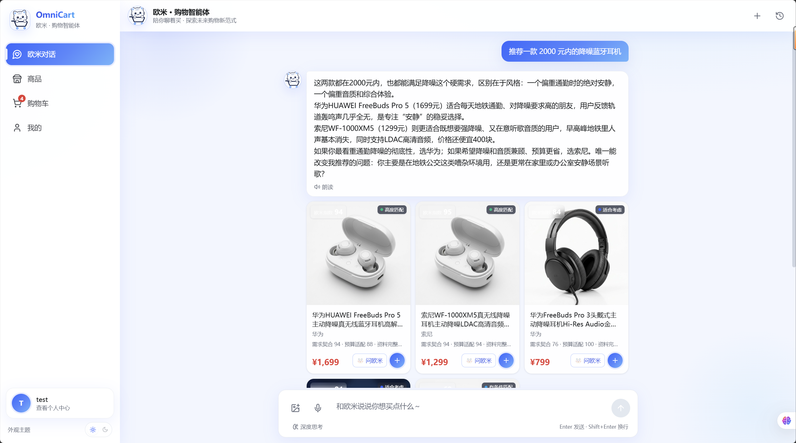
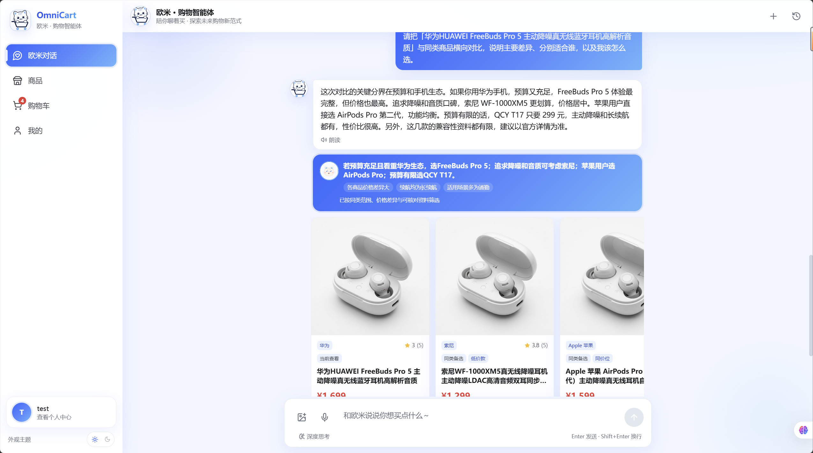
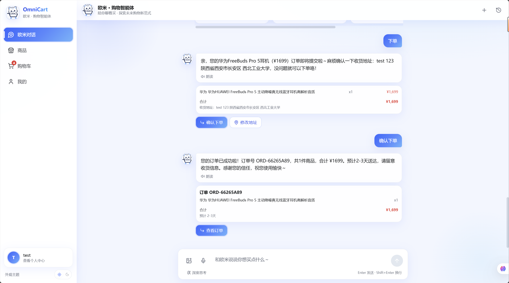
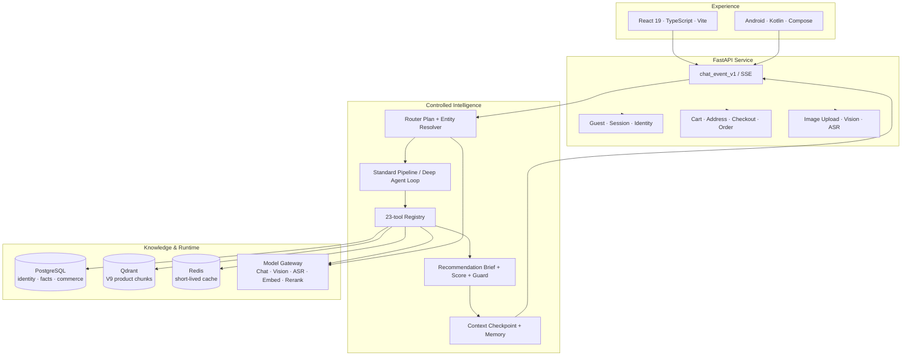

<p align="center">
  
</p>

<h1 align="center">OmniCart · 欧米</h1>

<p align="center">
  <strong>从一句真实需求，到一个有证据、可执行的购物决定。</strong>
</p>

<p align="center">
  Product-centric RAG · Controlled Agent Harness · Multimodal Commerce · Web & Android
</p>

<p align="center">
  <a href="https://github.com/TheodoreYang6/OmniCart-Agent/actions/workflows/backend-unit.yml"></a>
  <a href="https://github.com/TheodoreYang6/OmniCart-Agent/actions/workflows/backend-integration.yml"></a>
  <a href="https://github.com/TheodoreYang6/OmniCart-Agent/actions/workflows/lint.yml"></a>
  <a href="https://github.com/TheodoreYang6/OmniCart-Agent/actions/workflows/smoke.yml"></a>
</p>

<p align="center">
  
  
  
  
  
  
</p>

<p align="center">
  <a href="#为什么是-omnicart">为什么是 OmniCart</a> ·
  <a href="#系统如何工作">系统如何工作</a> ·
  <a href="#实测与质量">实测与质量</a> ·
  <a href="#快速开始">快速开始</a> ·
  <a href="#工程地图">工程地图</a> ·
  <a href="#参与项目">参与项目</a>
</p>

---

> 电商平台擅长返回商品列表，真正困难的却是理解人的模糊需求、核对分散证据、解释取舍，并安全地完成行动。OmniCart 把这条链路做成了一个可运行、可观察、可回退的购物智能体系统。

## 为什么是 OmniCart

OmniCart（欧米）是一套面向真实购物决策的多模态 Agentic Commerce 参考实现。用户可以用文字、语音或图片表达需求，系统会将预算、场景、偏好、硬约束和避雷项编译成结构化任务，再完成商品识别、检索、证据核对、推荐、对比、加购与下单。

它不是“给商品库接一个聊天框”，而是把模型的创造力放进明确的工程边界：

| 传统购物助手 | OmniCart |
| --- | --- |
| 把用户输入当作关键词 | 将自然语言编译为带约束、分组与证据目标的 `Router Plan` |
| 检索命中一段文本就推荐 | 以商品为交付单位，聚合身份、事实、说明、FAQ 与评价 |
| 模型自由生成商品与理由 | LLM 只在 Top 12 候选中闭集判断，服务端复核 ID、预算与硬条件 |
| 思考越久似乎越智能 | 工具预算、重复检测、权限门控与停止策略共同保证收敛 |
| 文案、卡片和价格各走一套逻辑 | 推荐简报是唯一事实源，Guard 在交付前完成一致性对账 |
| 多轮对话等于无限拼接历史 | 检查点、短期上下文与长期偏好按预算投影为单一 `AnswerContext` |

### 一条链路，完成购物闭环


### 真实双端体验

Web 适合信息密集的比较与连续决策，Android 适合随时发问、语音输入与拍照识别。两端共享 `chat_event_v1`、推荐卡片和交易动作语义，而不是维护两套“看起来相似”的智能逻辑。

<p align="center">
  
</p>

<p align="center"><sub>真实 Web 客户端：回答、适配指数、证据状态与商品卡同源交付。</sub></p>

<details>
<summary><strong>查看更多：同类横向对比与两阶段下单</strong></summary>
<br />
<p align="center">
  
</p>
<p align="center"><sub>同类对比围绕价格、核心特点、使用场景和注意点说明取舍。</sub></p>
<p align="center">
  
</p>
<p align="center"><sub>订单预览不落库，用户明确确认后才提交交易。</sub></p>
</details>

## 六个系统级创新

### 01 · 商品身份先于语义相似

品牌、商品名、产品线、型号、规格、SKU 与别名共同形成商品身份层。系统优先完成精确商品、系列、歧义或未命中的受控解析，再决定进入单品档案还是同类推荐，避免“苹果 15”被泛化成任意手机。

### 02 · V9 多视角、商品级 RAG

OmniCart 不让所有资料以相同粒度竞争。每件商品被组织为六类可回溯知识单元：

| Chunk | 保存什么 | 决策价值 |
| --- | --- | --- |
| `identity` | 标题、品牌、类目、价格、SKU | 锁定主体与硬信息 |
| `facts` | 来源可追溯的结构化属性 | 判断预算、规格和硬约束 |
| `marketing` | 按语义边界切分的商品说明 | 理解卖点与使用场景 |
| `faq` | 一问一答的官方知识 | 回答兼容性与使用问题 |
| `review` | 原始用户评价片段 | 提供真实体验信号 |
| `review_aspect` | 可追溯的体验/注意点聚合 | 提炼口碑但不放大单条评价 |

一次 `shopping.search` 的内部流程是确定的：

```text
一次 Query Embedding
  → Dense / 可选 Dense + Sparse 召回 Top 100 Chunks
  → 按 product_id 聚合为 Top 24 Products
  → 本地 BGE Reranker 压缩为 Top 12
  → 闭集 LLM Filter
  → 证据包、评分与商品卡
```

任何向量维度不匹配都会显式降级，评论可以补充判断，但不能越过商品身份与事实成为排序真源。

### 03 · Harness 化的受控 Agent Loop

深度模式不是无限 ReAct。运行时将自主性拆成四个可测试的阶段：

```text
ToolPolicy → ToolExecutor → ToolResult Reducer → StopPolicy
```

- `ToolPolicy` 在调用前检查 JSON Schema、身份权限、锁定商品范围、预算与语义重复；
- `ToolExecutor` 通过统一注册表执行 23 个购物、购物车、订单、偏好和会话工具；
- `Reducer` 只接收增量状态补丁，失败不会覆盖已经成功的候选与证据；
- `StopPolicy` 在任务完成、信息不再增益、重复调用或预算耗尽时强制收敛。

常规模式与深度模式共享同一套交付标准；差别只在核对预算，而不在事实口径。

### 04 · 可信推荐不是一个分数

系统刻意拆开四类语义：

- `retrieval_rank` 只回答“候选有多相关”；
- `filter_verdict` 表示首选、备选、有条件匹配或排除；
- `evidence_status` 表示资料是否足以支持当前判断；
- **欧米适配指数**只衡量商品对本次需求的适配程度。

适配指数按需求契合 60%、预算适配 20%、资料完整度 20% 可复算；硬约束失败或明确超预算会触发封顶，避免“资料多”把不合适的商品冲成高分。

### 05 · 单一事实流与交付 Guard

推荐正文、首选/备选卡、单品档案、横向对比和购物动作都来自同一份推荐简报。首选最多 3 件、备选最多 6 件；多目标请求会为每个已命中分组保留展示位，同型号变体不会挤满首选区。

最终回答还会核验商品范围、价格、证据引用、风险提示、需求组覆盖与敏感表述。Guard 失败时使用确定性模板降级，而不是把未经验证的生成内容直接交给用户。

### 06 · 上下文是被治理的资源

`ConversationContextAssembler` 只向最终回答提供一份受预算约束的 `AnswerContext`：当前任务、会话检查点、最近完整回合、本轮可信候选与证据、相关且未过期的偏好，以及必要的视觉事实。

原始工具参数、过期候选、ReAct 草稿与 scratchpad 永远留在运行时账本中。这样既能理解“第二款便宜一点”，也能在用户更换品类时干净地结束旧任务。

## 系统如何工作



### 模型与系统的边界

| 模型负责 | 系统强制保证 |
| --- | --- |
| 理解口语化需求与潜在意图 | 明确约束优先、品类白名单、歧义状态 |
| 在有限候选中做综合权衡 | 候选 ID 闭集、价格与事实复核、稳定回退 |
| 选择允许调用的工具 | Schema、权限、超时、预算、重复签名、确认流 |
| 生成自然、可读的建议 | 卡片与正文同源、敏感表述与引用 Guard |
| 从图片中提取身份线索 | 目录解析器决定能否锁定具体商品 |

### 统一流式协议

```text
stage → visual_result → recommendations → focus_analysis / comparison
      → token → result → done
```

卡片可以先于长文本到达；客户端只展示“正在理解 / 挑选 / 核对 / 整理”等用户友好阶段，不暴露思维链、工具参数或内部 scratchpad。最终 `result` 保存完整的受控结果，`done` 给出明确结束原因。

## 实测与质量

### 可复核的检索结果

以下数字来自仓库内已提交的离线评测产物，不是规划目标或线上性能承诺：

| 评测 | 数据量 | 实测结果 | 原始产物 |
| --- | ---: | --- | --- |
| 子品类纯度 | 30 cases | `purity@5 = 0.907` · 库存归一 `0.947` | [`purity-v7_release.json`](data/rag_eval_runs/purity-v7_release.json) |
| FAQ 形态检索 | 64 queries | `hit@1 = 0.953` · `hit@5 = 0.969` · `MRR@10 = 0.963` | [`retrieval-v7_hybrid.json`](data/rag_eval_runs/retrieval-v7_hybrid.json) |
| 标题形态检索 | 64 queries | `hit@1 = 0.656` · `hit@5 = 0.906` · `MRR@10 = 0.787` | [`retrieval-v7_hybrid.json`](data/rag_eval_runs/retrieval-v7_hybrid.json) |

评测数据完整保留逐版本 run，便于对检索、索引与 Prompt 变更做回归对拍。端到端指标文件同时保留实际均值与明细；文档中的目标值不会被包装成当前成绩。

### 数据资产

| 商品 | 图片 | 大类 | 知识形态 |
| ---: | ---: | ---: | --- |
| 1,000 | 1,088 | 8 | 商品主数据、SKU、说明、FAQ、评价、身份别名与派生事实 |

数据覆盖美妆护肤、数码电子、服饰运动、食品生活、家居用品、母婴用品、运动户外与个护清洁。数据初始化、身份索引、事实回填与 V9 Chunk 构建均由版本化脚本完成。

### 工程门禁

当前测试套件可收集 516 个后端测试，覆盖 Agent Loop、检索聚合、实体解析、Guard、SSE、会话连续性、交易闭环、语音与上传等关键契约。CI 同时执行：

- Python 单元测试与覆盖率；
- 无外部依赖的 MOCK 集成测试；
- Ruff 与 import-linter 分层约束；
- 服务启动、健康检查与推荐冒烟测试。

Web 侧提供类型检查、ESLint、Vitest、Playwright 和生产构建门禁；Android 侧以 Debug APK 构建验证为最低交付门槛。

```powershell
# Backend
pytest tests/unit backend/tests/unit -q
ruff check backend/app/framework backend/app/providers backend/app/core/config.py
$env:PYTHONPATH = "backend"
python scripts/check_governance.py

# Web
Set-Location web-client
npm run typecheck
npm run lint
npm run test
npm run build

# Android
Set-Location ..\android-client
.\gradlew.bat :app:assembleDebug
```

## 快速开始

### 环境要求

- Python 3.11+
- Node.js 20+（推荐）
- Docker Desktop（完整数据栈需要）
- JDK 17 与 Android Studio（仅 Android 开发需要）

### 5 分钟零密钥体验

MOCK 模式会保留 Router、工作流、卡片、SSE 与降级结构，不调用真实模型；适合先体验界面或开发协议层。

```powershell
git clone https://github.com/TheodoreYang6/OmniCart-Agent.git
Set-Location OmniCart-Agent

Copy-Item .env.example .env
py -3.11 -m venv .venv
.\.venv\Scripts\Activate.ps1
python -m pip install -r requirements.txt

Set-Location web-client
npm ci
Set-Location ..

$env:OMNICART_MOCK_MODE = "true"
$env:OMNICART_USE_LOCAL_MODELS = "false"
$env:DATABASE_URL = ""
$env:QDRANT_URL = ""
$env:REDIS_URL = ""
python run.py
```

打开 `http://127.0.0.1:5173`；健康检查位于 `http://127.0.0.1:8006/api/health`，OpenAPI 文档位于 `http://127.0.0.1:8006/docs`。

<details>
<summary><strong>macOS / Linux</strong></summary>
<br />

```bash
git clone https://github.com/TheodoreYang6/OmniCart-Agent.git
cd OmniCart-Agent
cp .env.example .env
python3.11 -m venv .venv
source .venv/bin/activate
python -m pip install -r requirements.txt
(cd web-client && npm ci)

export OMNICART_MOCK_MODE=true
export OMNICART_USE_LOCAL_MODELS=false
export DATABASE_URL=
export QDRANT_URL=
export REDIS_URL=
python run.py
```

</details>

### 启动完整数据栈

```powershell
docker compose up -d postgres qdrant redis

# 将 .env 中 DATABASE_URL 的密码配置为 docker-compose.yml 中的 omnicart
alembic upgrade head
$env:PYTHONPATH = "backend"
python scripts/seed_postgresql.py
python scripts/build_product_identity_index.py
python scripts/index_product_chunks_v9.py --recreate

python run.py
```

V9 索引构建需要可用的 Embedding 配置，并会写入 Qdrant。真实推理模式还需要在 `.env` 中配置模型 API Key，或准备本地 Embedding / Reranker 权重。配置入口统一位于 [`backend/app/model_gateway/model_config.yaml`](backend/app/model_gateway/model_config.yaml) 与 [`.env.example`](.env.example)。

### Android 真机联调

Debug 变体默认访问电脑端 `127.0.0.1:8006`。USB 连接设备后执行：

```powershell
adb reverse tcp:8006 tcp:8006
```

随后用 Android Studio 打开 [`android-client`](android-client) 并运行 `app`。

## 工程地图

```text
OmniCart-Agent/
├── backend/app/
│   ├── api/                    # HTTP / SSE 边界
│   ├── workflow/               # Pipeline、动态编排与双档 ReAct 图
│   ├── agents/                 # Router / Retrieval / Decision / Response / Visual
│   ├── framework/              # 领域无关协议、注册表、检索、记忆与工具框架
│   ├── providers/              # 电商领域 Provider 与 23 个工具实现
│   ├── retrieval/              # V9 Chunk、Dense/Sparse、商品聚合与 Rerank
│   ├── services/               # 实体解析、Filter、简报、评分、对比与结算
│   ├── context/                # AnswerContext 与会话投影
│   ├── verification/           # Evidence Checker 与 Response Guard
│   ├── model_gateway/          # Chat / Vision / ASR / Embed / Rerank 统一网关
│   └── models · schemas · repositories · observability
├── web-client/                 # React 19 + TypeScript + Vite + Zustand
├── android-client/             # Kotlin + Jetpack Compose + Retrofit
├── ecommerce_agent_dataset/    # 1,000 件商品与 1,088 张图片
├── alembic/                    # 15 个数据库迁移
├── scripts/                    # 建库、索引、评测、治理与运维
├── tests/ + backend/tests/     # 单元、契约、集成、评测与手工测试
├── data/rag_eval_runs/         # 可复核的离线评测记录
└── docs/                       # 架构规格、开发文档与参赛材料
```

后端坚持单向依赖：`schemas → framework → providers → orchestration`。`framework/` 不感知商品、购物车等领域概念，业务能力通过显式 `builtin()` 清单装配；import-linter 与治理脚本共同阻止层级腐化和漏注册。

### 关键接口

| 接口 | 用途 |
| --- | --- |
| `POST /api/recommend/stream` | 主 SSE 对话；支持常规、深度、图片、单品分析与同类对比 |
| `POST /api/recommend` / `v2` | 同步推荐接口与兼容入口 |
| `POST /api/upload` | 图片上传、大小限制与真实格式校验 |
| `POST /api/voice/transcribe` | ASR 转写与质量门控 |
| `GET /api/products` / `{id}` | 商品浏览与详情 |
| `POST /api/agent/action` | 受控 Agent 购物动作入口 |
| `/api/cart` · `/api/checkout` · `/api/orders` | 购物车、两阶段结算与订单生命周期 |
| `/api/auth` · `/api/addresses` · `/api/conversations` | 身份、地址与会话能力 |

### 延伸阅读

| 文档 | 适合谁 |
| --- | --- |
| [`DEVELOPMENT.md`](DEVELOPMENT.md) | 第一次接手仓库、配置环境与开发流程 |
| [`MODULES.md`](MODULES.md) | 理解模块职责、依赖边界与改动注意事项 |
| [`docs/欧米技术架构总览.md`](docs/欧米技术架构总览.md) | 深入阅读系统架构、运行平面与证据链 |
| [`docs/specs/omni-harness/spec.md`](docs/specs/omni-harness/spec.md) | 受控 Agent Harness 的设计规格 |
| [`DEPLOY.md`](DEPLOY.md) | Docker 部署、数据初始化与 Android 构建 |
| [`SERVER_OPS.md`](SERVER_OPS.md) | 日常启停、健康检查、日志与备份 |

## 参与项目

欢迎围绕以下方向发起 Issue 或 Pull Request：商品身份解析、多视角检索、评测集与指标、Agent 工具治理、Web / Android 体验，以及更多可验证的交易能力。

提交前建议至少完成与你改动对应的测试；如果修改了检索、评分、Prompt 或索引结构，请同时提交可复核的评测对比。新增工具应实现 `ToolSpec` / `ToolResult` 契约、登记进显式注册清单，并为权限和失败路径补充测试。

---

<p align="center">
  
</p>

<p align="center">
  <strong>OmniCart · Turn intent into evidence, and evidence into action.</strong>
</p>

<p align="center"><sub>让每一次购物对话，都更接近一个值得信任的决定。</sub></p>
